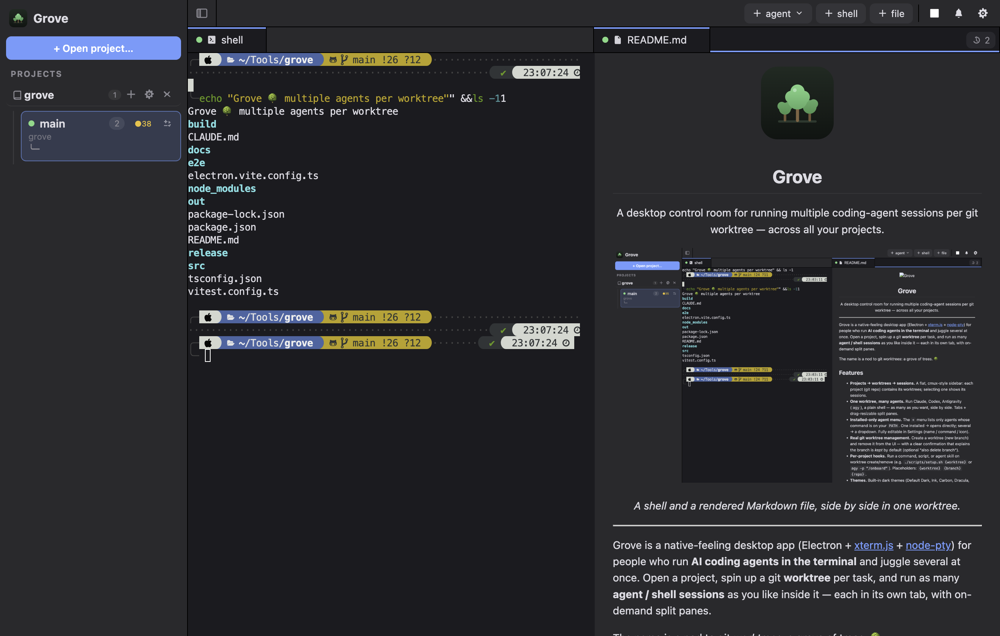

<div align="center">
  
  <h1>Grove</h1>
  <p>A desktop control room for running multiple coding-agent sessions per git worktree — across all your projects.</p>
</div>

<div align="center">
  
  <p><em>A shell and a rendered Markdown file, side by side in one worktree.</em></p>
</div>

---

Grove is a native-feeling desktop app (Electron + [xterm.js](https://xtermjs.org) + [node-pty](https://github.com/microsoft/node-pty)) for people who run **AI coding agents in the terminal** and juggle several at once. Open a project, spin up a git **worktree** per task, and run as many **agent / shell sessions** as you like inside it — each in its own tab, with on-demand split panes.

The name is a nod to git *worktrees*: a grove of trees. 🌳

## Features

- **Projects → worktrees → sessions.** A flat, cmux-style sidebar: each project (git repo) contains its worktrees; selecting one shows its sessions.
- **One worktree, many agents.** Run Claude, Codex, Antigravity (`agy`), a plain shell — as many as you want, side by side. Tabs + drag-resizable split panes.
- **Open files in a pane.** Open a Markdown or HTML file (`+ file`) in a read-only viewer alongside your terminals — Markdown is rendered and sanitized; HTML loads in a sandboxed frame.
- **Review worktree changes.** Hit *Review changes* on any worktree card for an in-app `git diff` (committed + uncommitted) rendered as a unified code-review pane.
- **Installed-only agent menu.** The `+` menu lists only agents whose command is on your `PATH`. One installed → opens directly; several → a dropdown. Fully editable in Settings (name / command / icon).
- **Real git worktree management.** Create a worktree (new branch) and remove it from the UI — with a clear confirmation that explains the branch is *kept* by default (optional "also delete branch").
- **Per-project hooks.** Run a command, script, or agent skill on worktree create/remove (e.g. `./scripts/setup.sh {worktree}` or `agy -p "/onboard"`). Placeholders: `{worktree}` `{branch}` `{repo}`.
- **Themes.** Built-in dark themes (Default Dark, Ink, Carbon, Dracula, Nord, Gruvbox, Solarized) + custom colours, applied live. Optional translucent (macOS vibrancy) window.
- **Configurable keyboard shortcuts.** kitty-style `Ctrl+Shift+…` defaults (split, new shell, close, next/prev, focus, sidebar), all remappable.
- **Notifications.** A tab/worktree highlights when an agent needs your input; jump to it from the toolbar.
- **Persistence.** Recent projects, open sessions, layout, and settings survive relaunch.

## Getting started

```bash
npm install          # postinstall fixes node-pty's spawn-helper +x bit
npm run build        # electron-vite build
npm start            # launch the built app  (or: npm run dev)
```

Requires Node and a recent Electron-supported macOS/Linux. node-pty runs under Electron without `electron-rebuild`.

## Configuration

Open **Settings** (⚙ in the toolbar, or `⌘,`):

- **Theme** — pick a preset swatch or set custom background/text colours; toggle a transparent window + opacity.
- **Agents** — add/edit/remove agents (icon, name, command). A green dot = installed (on `PATH`).
- **Worktree** — the folder template for new worktrees (`../{repo}-wt-{branch}` by default). Placeholders: `{repo}` `{branch}` `{timestamp}`.
- **Keyboard shortcuts** — remap any action.

**Per-project hooks** live on each project's ⚙ in the sidebar (they differ per repo, so they aren't global).

## Architecture

```
src/
  core/      Electron-free, unit-tested logic (worktree git ops, session
             registry, state detection, project/layout/settings stores)
  main/      Electron main process — IPC, pty spawning, window
  preload/   contextBridge API surface
  renderer/  React UI (sidebar, tabs, xterm panes, settings, dialogs)
```

- The **core** is pure Node and covered by [Vitest](https://vitest.dev); the Electron layers are validated by `typecheck && build` and an end-to-end smoke test.
- Terminals use the **canvas** renderer (the DOM renderer mis-draws box-drawing glyphs); the bundled *MesloLGS NF* Nerd Font ships the icons agents rely on.

## Development

```bash
npm run typecheck    # tsc --noEmit
npm test             # vitest (core logic)
npm run e2e          # build + Playwright _electron smoke test
```

The e2e test drives the built app against throwaway git repos and asserts the full Project → Worktree → Session flow (multi-project, split panes, real worktree create, agent launch, disk round-trip, persistence).

## License

MIT
